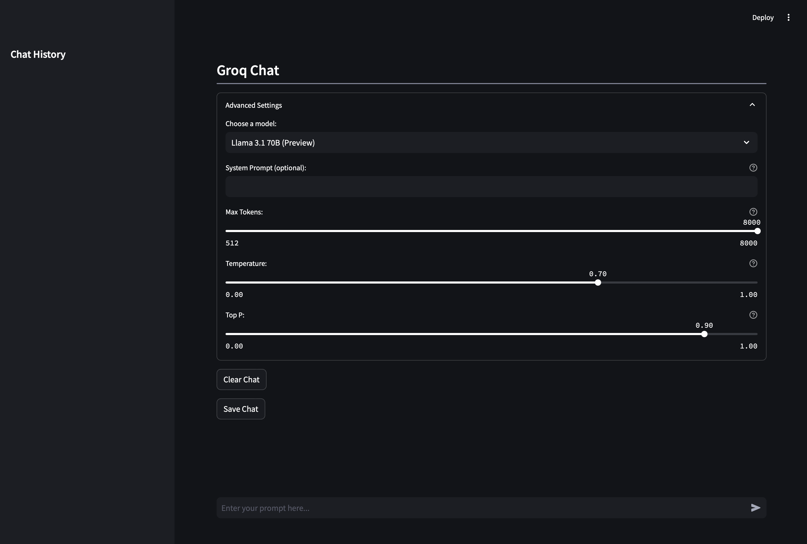
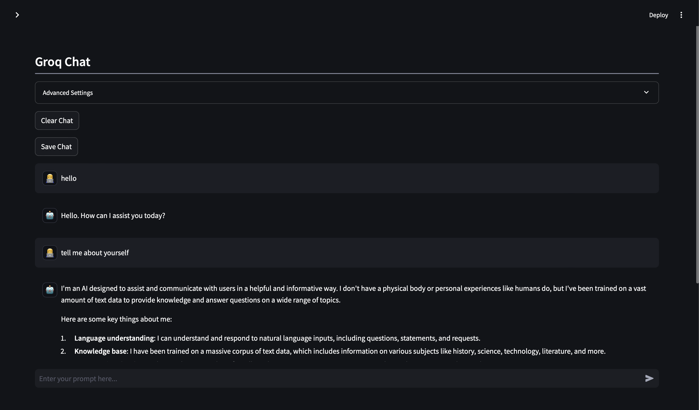
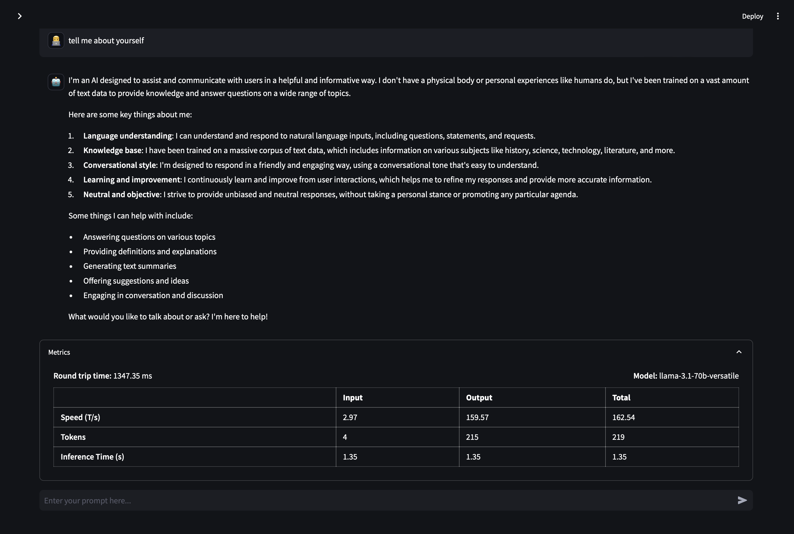

---

# AI Chat Application





## Table of Contents
1. [Introduction](#introduction)
2. [Features](#features)
3. [Requirements](#requirements)
4. [Installation](#installation)
5. [Usage](#usage)
6. [Configuration](#configuration)
7. [Advanced Settings](#advanced-settings)
8. [Chat History](#chat-history)
9. [Metrics](#metrics)
10. [Troubleshooting](#troubleshooting)
11. [Contributing](#contributing)
12. [License](#license)
13. [Code Overview](#code-overview)

## Introduction

The Groq Chat Application is an interactive chat powered by the Groq API. Built with Streamlit, this application offers users the ability to engage in dynamic conversations with various state-of-the-art open source language models. It's designed to provide both casual users and AI enthusiasts with a user-friendly platform to explore the capabilities of different language models, customize their behavior, and analyze their performance in real-time.

## Features

- **Interactive Chat Interface**: A clean, intuitive chat UI that mimics popular messaging applications for ease of use.
- **Multi-Model Support**: Integration with multiple language models, including:
  - Gemma-7b-it
  - LLaMA3-70b-8192
  - LLaMA3-8b-8192
  - Mixtral-8x7b-32768
  - Llama 3.1 70B (Preview)
  - Llama 3.1 8B (Preview)
  - Llama 3 Groq 70B Tool Use (Preview)
  - Llama 3 Groq 8B Tool Use (Preview)
- **Customizable System Prompts**: Ability to set custom system prompts to guide the model's behavior and context.
- **Adjustable Model Parameters**: Fine-tune the model's output with controls for:
  - Temperature
  - Top P
  - Max Tokens
- **Chat History Management**: 
  - Automatic saving of chat sessions
  - Ability to load and continue previous conversations
  - Clear chat option for starting fresh
- **Real-time Performance Metrics**: Detailed metrics displayed after each interaction, including:
  - Round trip time
  - Token counts (input, output, total)
  - Processing speeds
  - Inference time
- **Responsive Design**: Adapts to different screen sizes for a consistent experience across devices.
- **Error Handling**: Robust error handling with informative messages for troubleshooting.

## Requirements

- Python 3.7 or higher
- Streamlit (1.0.0 or higher)
- Groq API client
- python-dotenv
- requests
- A valid Groq API key

## Installation

1. Clone the repository:
   ```bash
   git clone https://github.com/yourusername/groq-chat-app.git
   cd groq-chat-app
   ```

2. Create a virtual environment (optional but recommended):
   ```bash
   python -m venv venv
   source venv/bin/activate  # On Windows use `venv\Scripts\activate`
   ```

3. Install the required packages:
   ```bash
   pip install -r requirements.txt
   ```

4. Create a `.env` file in the project root and add your Groq API key:
   ```env
   GROQ_API_KEY=your_api_key_here
   ```

## Usage

1. Ensure you're in the project directory and your virtual environment is activated (if used).

2. Run the Streamlit application:
   ```bash
   streamlit run app.py
   ```

3. Open your web browser and navigate to the URL provided by Streamlit (usually `http://localhost:8501`).

4. Use the chat interface to interact with the selected language model:
   - Type your message in the input box at the bottom of the screen.
   - Press Enter or click the send button to submit your message.
   - The model's response will appear in the chat window.

5. Explore advanced settings and metrics using the provided UI elements.

## Configuration

The application primarily uses environment variables for configuration:

1. Create a `.env` file in the project root if you haven't already.
2. Add your Groq API key:
   ```env
   GROQ_API_KEY=your_api_key_here
   ```
3. Optionally, you can add other environment variables for default settings:
   ```env
   DEFAULT_MODEL=llama3-70b-8192
   DEFAULT_TEMPERATURE=0.7
   DEFAULT_TOP_P=0.9
   ```

The application will load these environment variables using the `python-dotenv` package.

## Advanced Settings

The "Advanced Settings" expander provides several options to customize the chat experience:

- **Model Selection**: Choose from a variety of language models with different capabilities and token limits.
- **System Prompt**: Set a custom system prompt to guide the model's behavior or provide context for the conversation.
- **Max Tokens**: Adjust the maximum number of tokens (words) for the model's response. This slider dynamically adjusts based on the selected model's capabilities.
- **Temperature**: Control the randomness of the model's output. Lower values (closer to 0) make the output more deterministic, while higher values (closer to 1) make it more creative and diverse.
- **Top P**: Adjust the diversity of the model's output using nucleus sampling. Lower values make the output more focused, while higher values allow for more variety.

## Chat History

The application automatically manages chat history:

- **Saving**: Each chat session is automatically saved with a timestamp and model name.
- **Loading**: Previously saved chats can be loaded from the sidebar. Click on a timestamp to load that chat session.
- **Clearing**: The "Clear Chat" button allows you to start a new conversation without saving the current one.

Chat histories are stored in JSON format in the `chat_history` directory.

## Metrics

After each interaction, the application displays detailed performance metrics:

- **Round Trip Time**: Total time taken for the request and response.
- **Token Counts**: 
  - Input tokens: Number of tokens in your message
  - Output tokens: Number of tokens in the model's response
  - Total tokens: Sum of input and output tokens
- **Processing Speeds**: 
  - Input speed: Input tokens processed per second
  - Output speed: Output tokens generated per second
  - Total speed: Overall tokens processed per second
- **Inference Time**: Time taken by the model to generate the response

These metrics are displayed in an expandable section below each interaction, providing insights into the model's performance.

## Troubleshooting

If you encounter issues:

1. **API Key Issues**: 
   - Ensure your Groq API key is correctly set in the `.env` file.
   - Check that the `.env` file is in the correct directory.
   - Verify that your API key is active and has the necessary permissions.

2. **Package Installation Problems**:
   - Make sure all required packages are installed: `pip install -r requirements.txt`
   - Check for any version conflicts and try updating packages if necessary.

3. **Connection Errors**:
   - Verify that you have an active internet connection.
   - Check if the Groq API is experiencing any outages.

4. **Performance Issues**:
   - If the application is slow, try selecting a smaller model or reducing the max tokens.
   - Ensure your system meets the minimum requirements for running the application.

5. **Unexpected Model Behavior**:
   - Review your system prompt and adjust it if necessary.
   - Try adjusting the temperature and top_p values to fine-tune the model's output.


## Code Overview

This section provides a detailed explanation of the main components and functions in the application.

### Import Statements and Initial Setup

```python
import streamlit as st
from typing import Generator
from groq import Groq
import os
import logging
import json
from datetime import datetime
import requests
from dotenv import load_dotenv

load_dotenv()
logging.basicConfig(level=logging.INFO)
```

- The code begins by importing necessary libraries, including Streamlit for the web interface, Groq for API interactions, and others for various functionalities.
- `load_dotenv()` is called to load environment variables from a `.env` file.
- Logging is configured to INFO level for debugging purposes.

### Streamlit Configuration

```python
st.set_page_config(page_icon="💬", layout="wide", page_title="Groq Goes Brrrrrrrr...")
```

- This sets up the Streamlit page configuration, including the page icon, layout, and title.

### Utility Functions

#### `icon(emoji: str)`

- Displays an emoji as a Notion-style page icon.

  ```python
  def icon(emoji: str):
      st.write(
          f'<span style="font-size: 78px; line-height: 1">{emoji}</span>',
          unsafe_allow_html=True,
      )
  ```

#### `initialize_session_state()`

- Initializes various session state variables used throughout the application, including messages, selected model, system prompt, and various model parameters.

  ```python
  def initialize_session_state():
      if "messages" not in st.session_state:
          st.session_state.messages = []
      if "selected_model" not in st.session_state:
          st.session_state.selected_model = "llama3-70b-8192"
      if "system_prompt" not in st.session_state:
          st.session_state.system_prompt = ""
      if "temperature" not in st.session_state:
          st.session_state.temperature = 0.7
      if "top_p" not in st.session_state:
          st.session_state.top_p = 0.9
      if "chat_history" not in st.session_state:
          st.session_state.chat_history = load_chat_history()
  ```

#### `get_groq_client() -> Groq`

- Initializes and returns the Groq client using the API key from environment variables.

  ```python
  def get_groq_client() -> Groq:
      api_key = os.getenv("GROQ_API_KEY")
      if not api_key:
          st.error("API key not found. Please set the GROQ_API_KEY environment variable.")
          st.stop()
      return Groq(api_key=api_key)
  ```

#### `display_chat_messages()`

- Renders the chat messages stored in the session state.

  ```python
  def display_chat_messages():
      for message in st.session_state.messages:
          avatar = '🤖' if message["role"] == "assistant" else '👨‍💻'
          with st.chat_message(message["role"], avatar=avatar):
              st.markdown(message["content"])
  ```

#### `generate_chat_responses(chat_completion) -> Generator[str, None, None]`

- A generator function that yields chat response content from the Groq API response.

  ```python
  def generate_chat_responses(chat_completion) -> Generator[str, None, None]:
      for chunk in chat_completion:
          if chunk.choices[0].delta.content:
              yield chunk.choices[0].delta.content
  ```

#### `save_chat_history()` and `load_chat_history()`

- Functions to save and load chat history to/from JSON files.

  ```python
  def save_chat_history():
      if not os.path.exists(CHAT_HISTORY_DIR):
          os.makedirs(CHAT_HISTORY_DIR)
      timestamp = datetime.now().strftime("%Y-%m-%d_%H-%M-%S")
      model_name = st.session_state.selected_model
      filename = os.path.join(CHAT_HISTORY_DIR, f"chat_{timestamp}_{model_name}.json")
      with open(filename, "w") as f:
          json.dump(st.session_state.messages, f)
      st.session_state.chat_history[filename] = f"{timestamp} ({model_name})"
      with open(CHAT_HISTORY_FILE, "w") as f:
          json.dump(st.session_state.chat_history, f)

  def load_chat_history():
      if os.path.exists(CHAT_HISTORY_FILE):
          with open(CHAT_HISTORY_FILE, "r") as f:
              return json.load(f)
      return {}
  ```

#### `load_chat(filename)`

- Loads a specific chat session from a file.

  ```python
  def load_chat(filename):
      with open(filename, "r") as f:
          st.session_state.messages = json.load(f)
  ```

### Main Application Logic

The `main()` function contains the core logic of the application:

1. **Setup and Initialization**:
   - Calls `icon()` to display the page icon.
   - Initializes the Groq client and session state.

2. **Model Configuration**:
   - Defines a dictionary of available models with their details.

3. **Advanced Settings**:
   - Creates an expander for advanced settings, including model selection, system prompt, and various model parameters.

4. **Chat Interface**:
   - Displays existing chat messages.
   - Provides input for new user messages.

5. **API Interaction**:
   - When a user sends a message, it prepares the conversation history and sends a request to the Groq API.
   - Handles the streaming response from the API and displays it in real-time.

6. **Metrics Calculation and Display**:
   - Calculates various performance metrics after each interaction.
   - Displays these metrics in an expandable section.

7. **Error Handling**:
   - Catches and displays any errors that occur during API interactions.

8. **Chat History Management**:
   - Provides options to save, load, and clear chat history.

  ```python
  def main():
      icon(" ")
      st.subheader("Groq Chat", divider="gray", anchor=False)

      client = get_groq_client()
      initialize_session_state()

      models = {
          "gemma-7b-it": {"name": "Gemma-7b-it", "tokens": 8192, "developer": "Google"},
          "llama3-70b-8192": {"name": "LLaMA3-70b-8192", "tokens": 8192, "developer": "Meta"},
          # Add other models here...
      }

      with st.expander("Advanced Settings"):
          model_option = st.selectbox(
              "Choose a model:",
              options=list(models.keys()),
              format_func=lambda x: models[x]["name"],
              index=1
          )

          if st.session_state.selected_model != model_option:
              st.session_state.messages = []
              st.session_state.selected_model = model_option

          st.text_input(
              "System Prompt (optional):",
              value=st.session_state.system_prompt,
              on_change=lambda: st.session_state.update({"system_prompt": st.session_state.system_prompt}),
              key="system_prompt"
          )

          max_tokens_range = models[model_option]["tokens"]

          max_tokens = st.slider(
              "Max Tokens:",
              min_value=512,
              max_value=max_tokens_range,
              value=min(8192, max_tokens_range),
              step=512
          )

          st.session_state.temperature = st.slider(
              "Temperature:",
              min_value=0.0,
              max_value=1.0,
              value=st.session_state.temperature,
              step=0.1
          )

          st.session_state.top_p = st.slider(
              "Top P:",
              min_value=0.0,
              max_value=1.0,
              value=st.session_state.top_p,
              step=0.1
          )

      if st.button("Clear Chat"):
          st.session_state.messages = []

      if st.button("Save Chat"):
          save_chat_history()

      display_chat_messages()

      if prompt := st.chat_input("Enter your prompt here..."):
          st.session_state.messages.append({"role": "user", "content": prompt})

          with st.chat_message("user", avatar='👨‍💻'):
              st.markdown(prompt)

          messages = []
          if st.session_state.system_prompt:
              messages.append({"role": "system", "content": st.session_state.system_prompt})
          messages.extend(st.session_state.messages)

          try:
              start_time = datetime.now()
              chat_completion = client.chat.completions.create(
                  model=model_option,
                  messages=messages,
                  max_tokens=max_tokens,
                  temperature=st.session_state.temperature,
                  top_p=st.session_state.top_p,
                  stream=True
              )

              with st.chat_message("assistant", avatar="🤖"):
                  chat_responses_generator = generate_chat_responses(chat_completion)
                  full_response = st.write_stream(chat_responses_generator)
              end_time = datetime.now()
              rtt = (end_time - start_time).total_seconds() * 1000

              input_tokens = len(prompt.split())
              output_tokens = len(full_response.split())
              total_tokens = input_tokens + output_tokens
              inference_time = (end_time - start_time).total_seconds()
              input_speed = input_tokens / inference_time
              output_speed = output_tokens / inference_time
              total_speed = total_tokens / inference_time

              with st.expander("Metrics"):
                  st.markdown(
                      f"""
                      <div style="background-color: ##121418; padding: 10px; border-radius: 5px; color: white;">
                          <div style="display: flex; justify-content: space-between; align-items: center;">
                              <div>
                                  <strong>Round trip time:</strong> {rtt:.2f} ms
                              </div>
                              <div>
                                  <strong>Model:</strong> {model_option}
                              </div>
                          </div>
                          <table style="width: 100%; margin-top: 10px;">
                              <thead>
                                  <tr>
                                      <th style="text-align: left;">&nbsp;</th>
                                      <th style="text-align: left;">Input</th>
                                      <th style="text-align: left;">Output</th>
                                      <th style="text-align: left;">Total</th>
                                  </tr>
                              </thead>
                              <tbody>
                                  <tr>
                                      <td style="text-align: left;"><strong>Speed (T/s)</strong></td>
                                      <td style="text-align: left;">{input_speed:.2f}</td>
                                      <td style="text-align: left;">{output_speed:.2f}</td>
                                      <td style="text-align: left;">{total_speed:.2f}</td>
                                  </tr>
                                  <trCertainly! Here is the continuation of the README from where it left off:

```markdown
                                  <tr>
                                      <td style="text-align: left;"><strong>Tokens</strong></td>
                                      <td style="text-align: left;">{input_tokens}</td>
                                      <td style="text-align: left;">{output_tokens}</td>
                                      <td style="text-align: left;">{total_tokens}</td>
                                  </tr>
                                  <tr>
                                      <td style="text-align: left;"><strong>Inference Time (s)</strong></td>
                                      <td style="text-align: left;">{inference_time:.2f}</td>
                                      <td style="text-align: left;">{inference_time:.2f}</td>
                                      <td style="text-align: left;">{inference_time:.2f}</td>
                                  </tr>
                              </tbody>
                          </table>
                      </div>
                      """,
                      unsafe_allow_html=True
                  )

          except Exception as e:
              st.error(f"An error occurred: {e}", icon="🚨")
              logging.error(f"Error fetching response: {e}")
              full_response = ""

          if isinstance(full_response, str):
              st.session_state.messages.append({"role": "assistant", "content": full_response})
          else:
              combined_response = "\n".join(str(item) for item in full_response)
              st.session_state.messages.append({"role": "assistant", "content": combined_response})

      st.sidebar.header("Chat History")
      for filename, timestamp in st.session_state.chat_history.items():
          if st.sidebar.button(timestamp):
              load_chat(filename)
              st.rerun()

  if __name__ == "__main__":
      main()
  ```

### Key Features in the Code

1. **Streaming Responses**: The application uses Streamlit's `st.write_stream()` to display model responses in real-time as they are generated.

2. **Dynamic Model Selection**: Users can switch between different models, with the interface adapting to each model's specific parameters (e.g., max tokens).

3. **Customizable Parameters**: Temperature, Top P, and Max Tokens can be adjusted in real-time, affecting the model's output.

4. **Persistent Chat History**: Chat sessions are saved and can be reloaded, allowing users to continue conversations across sessions.

5. **Performance Metrics**: Detailed metrics are calculated and displayed after each interaction, providing insights into the model's performance.

6. **Error Handling**: The code includes try-except blocks to gracefully handle and display errors, enhancing the user experience.

This code structure allows for a modular, maintainable, and feature-rich chat application that leverages the Groq API while providing a user-friendly interface through Streamlit.

---

